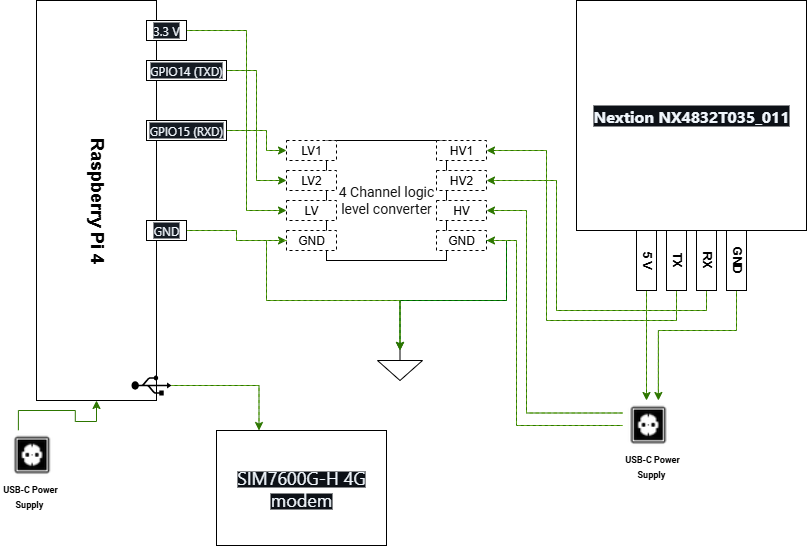
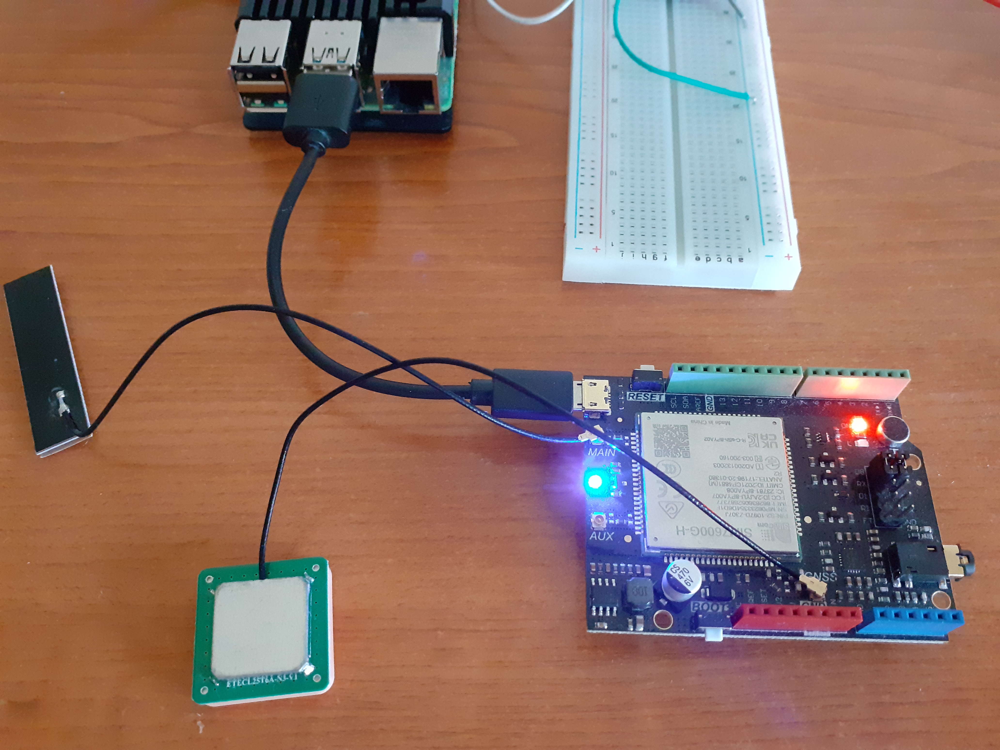
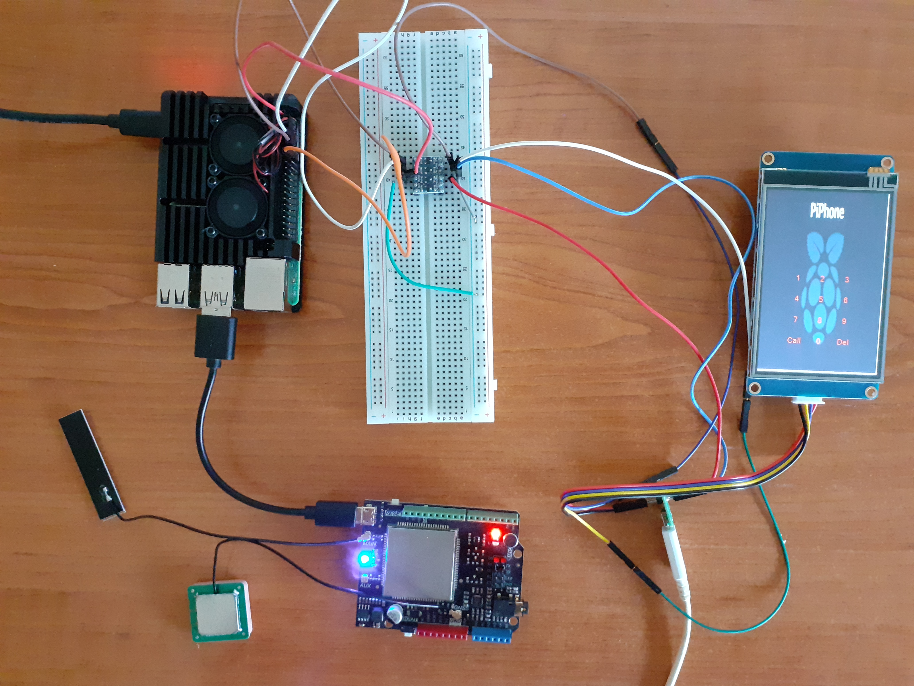
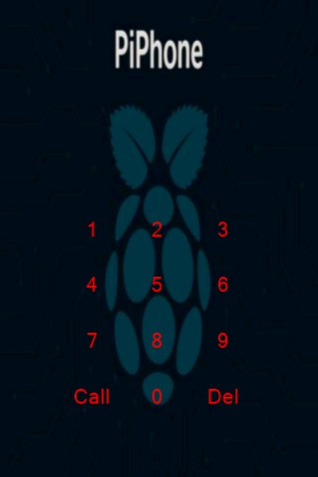
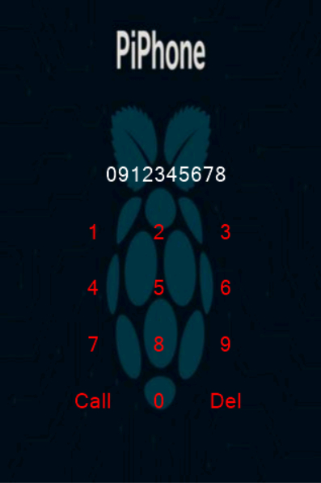
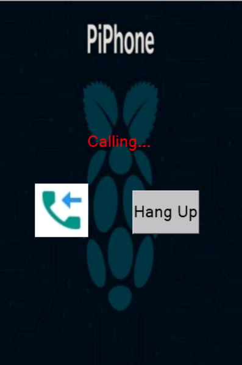
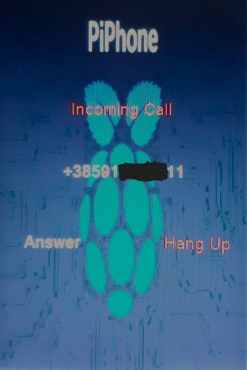

# PiPhone

A DIY phone based on Raspberry Pi 4, SIM7600G-H modem, and Nextion touchscreen, built with Buildroot.

[Hardware Documentation](docs/hardware.md)

---

## Features

- Custom **Buildroot-based Linux image**
- **Touchscreen dialing interface** on Nextion
- **SIM7600G-H 4G modem** for calls
- **Auto-start** modem handler and Wi‑Fi services
- Open hardware and software

## Hardware

- Raspberry Pi 4 Model B, 2GB RAM
- SIM7600G-H CAT4 4G (LTE) Shield
- SIM7600G‑H module requires antennas
    - MAIN (LTE antenna)
    - GNSS antenna
- regular SIM card
- MicroSD Card for flashing image on RPi 4
- Nextion NX4832T035_011 touchscreen
- SD card for upload `.tft` file to Nextion display
- Logic level shifter(required for Nextion RX)
- USB-C 5V/3A power supply for Raspberry Pi 4
- USB-A to Micro USB cable for SIM7600G-H
- USB-A to Micro USB cable for Nextion touchscreen
- Jumper wires
- Breadboard
  
  See full hardware details [here](docs/hardware.md)
### Wiring Diagram
<p align="center">
  
</p>

## Hardware Close‑ups
### SIM7600G-H Module + GPS Antenna

<p align="center">
    
</p>

### Full Hardware Setup
<p align="center">
  
</p>

## Software
- Buildroot external tree is in: `buildroot-external/`
- Overlays are in: `buildroot-external/overlays/rootfs/`
- Configs are in: [`buildroot-external/configs/piphone_defconfig`](buildroot-external/configs/piphone_defconfig)
- Kernel fragments are in: `buildroot-external/linux/fragments/`
- call_handler.py is in: [`buildroot-external/overlays/rootfs/usr/bin/call_handler.py`](buildroot-external/overlays/rootfs/usr/bin/call_handler.py)

### Python Serial Script

The script [`call_handler.py`](buildroot-external/overlays/rootfs/usr/bin/call_handler.py) handles:
- Unlocking the SIM card with a PIN
- Checking network registration
- Switching to voice mode
- Reading phone numbers from the Nextion display
- Sending AT commands to dial, answer, or hang up calls
- Displaying incoming call info on the Nextion screen
 

## Nextion UI

The Nextion touchscreen is used as the main user interface for PiPhone.

### Files

- [**software/PiPhoneUI.HMI**](software/Nextion_PiPhone.HMI) — Source file for editing in Nextion Editor

### Uploading the `.tft` File to the Nextion Display

To flash the Nextion screen with the PiPhone UI:
1. Copy the `.tft` file from the [`nextion/`](nextion) folder
2. Place the file on a **microSD card** (formatted FAT32).
3. Insert the microSD card into the Nextion display.
4. Power on the Nextion.
5. The screen will automatically:
- detect the `.tft` firmware,
- flash the display,
- and reboot when finished.
6. Remove the SD card after flashing.

## Screenshots

#### Main Screen
<p align="center">
  
</p>

#### Dialing Screen
<p align="center">
  
</p>

#### Call Screen
<p align="center">
  
</p>

#### Incoming Call
<p align="center">
  
</p>
## Screenshots

<div align="center">

### Main Screen


### Dialing Screen


### Call Screen


### Incoming Call


</div>
### How to Use

1. Open `software/PiPhoneUI.HMI` in Nextion Editor.
2. Edit as needed, then compile to generate a `.tft` file.
3. Upload `software/PiPhoneUI.tft` to your Nextion display via SD card or serial.


## Getting Started

1. **Clone Buildroot:**
    ```bash
    git clone https://github.com/buildroot/buildroot.git
    ```
2. **Clone this repository:**
   ```bash
   git clone https://github.com/ivan-marusic/PiPhone.git
   ```
3. **Build:**
    ```bash
    cd buildroot
    make BR2_EXTERNAL=../PiPhone/buildroot-external piphone_defconfig
    make -j"$(nproc)"
    ```
4. **Finished image location:**
    ```bash
    output/images/sdcard.img
    ```
5. **Flashing the SD Card:**
    ```bash
    sudo dd if=output/images/sdcard.img of=/dev/sdX bs=4M status=progress conv=fsync
    sync
    ```
    Replace /dev/sdX with the correct SD device (lsblk).

## License
This project is MIT licensed unless stated otherwise in sub‑folders.

