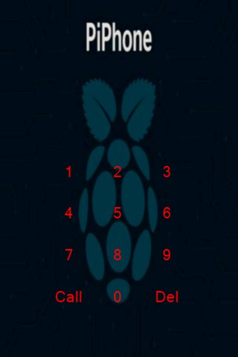
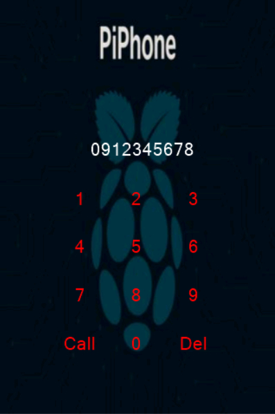
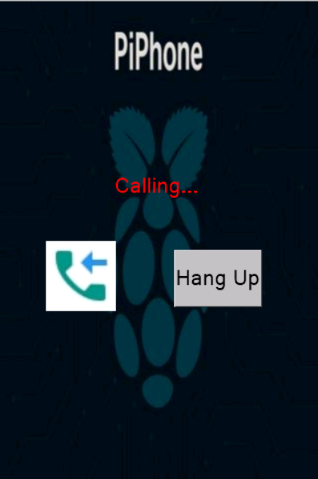

# PiPhone

A DIY phone based on Raspberry Pi 4, SIM7600G-H modem, and Nextion touchscreen, built with Buildroot.

[Hardware Documentation](hardware.md)

---

## Features

- Custom Buildroot-based Linux system
- Touchscreen dialing interface (Nextion)
- 4G modem for calls, SMS, and GPS (SIM7600G-H)
- Open hardware and software

## Hardware

- Raspberry Pi 4
- SIM7600G-H 4G Shield
- Nextion NX4832T035_011 touchscreen
- Logic level shifter

  See full hardware details [here](hardware.md)

## Software

- Buildroot config and overlays in `/buildroot`
- Nextion HMI files and scripts in [`/nextion`](nextion/)
- Custom scripts for dialing, AT commands, etc.

## Nextion UI

The Nextion touchscreen is used as the main user interface for PiPhone.

### Files

- [**software/PiPhoneUI.HMI**](nextion/novitest3.HMI) — Source file for editing in Nextion Editor
- [**software/PiPhoneUI.tft**](nextion/novitest3.tft) — Compiled file for uploading to the Nextion display

### Screenshots
#### Main Screen

#### Dialing Screen

#### Call Screen


### How to Use

1. Open `software/PiPhoneUI.HMI` in Nextion Editor.
2. Edit as needed, then compile to generate a `.tft` file.
3. Upload `software/PiPhoneUI.tft` to your Nextion display via SD card or serial.


## Getting Started

1. **Clone this repo:**
   ```bash
   git clone https://github.com/ivan-marusic/PiPhone.git
   ```
